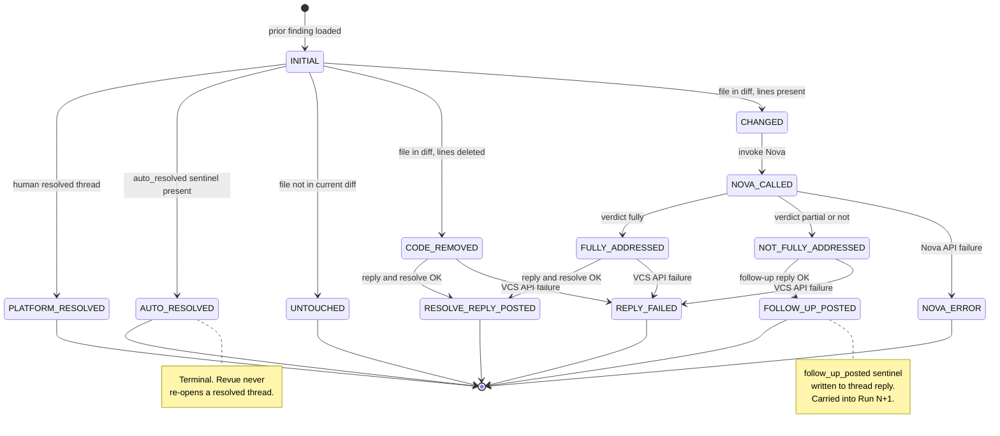
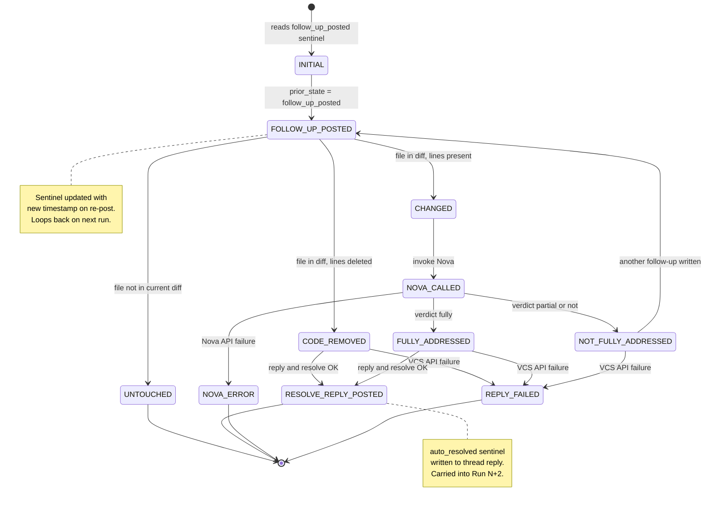
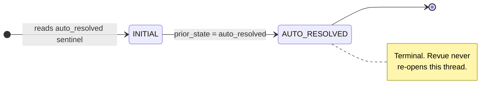
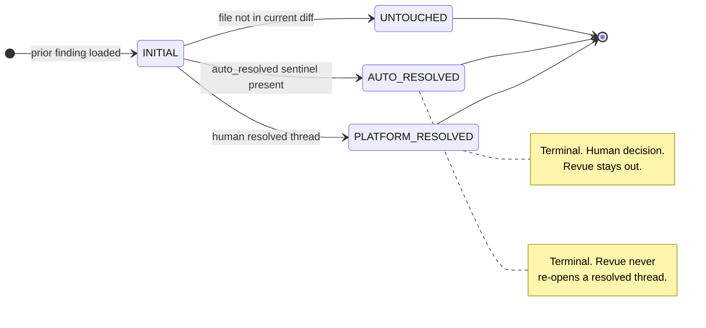
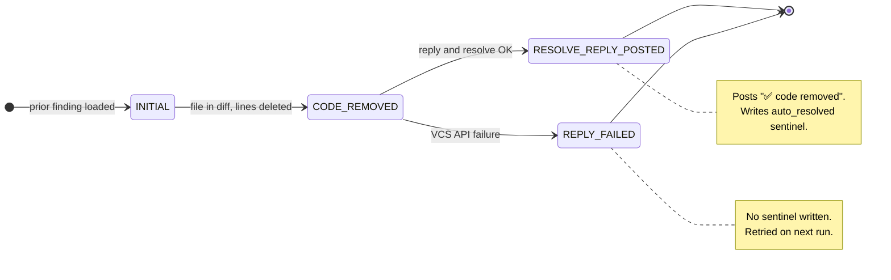
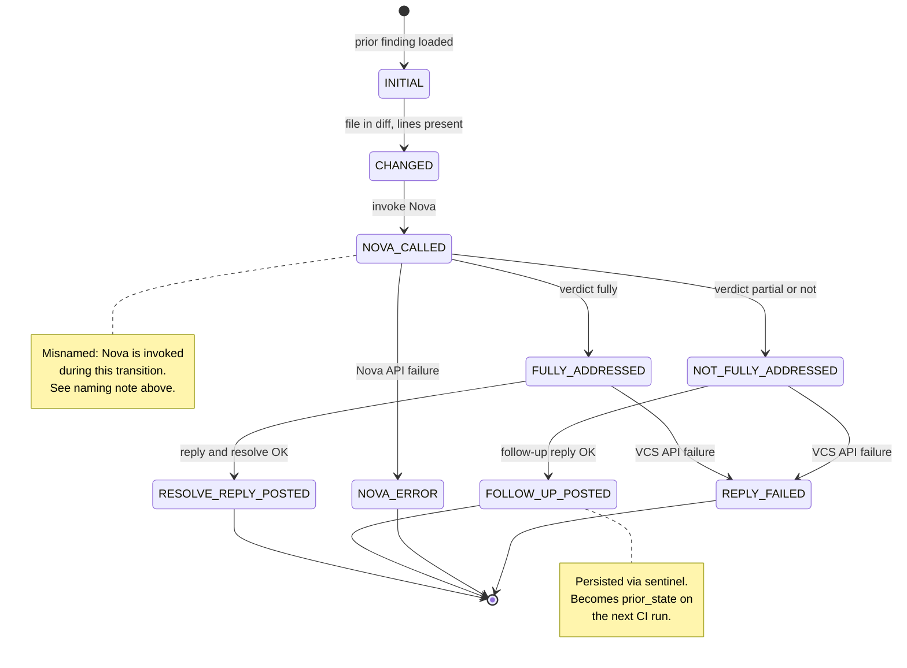
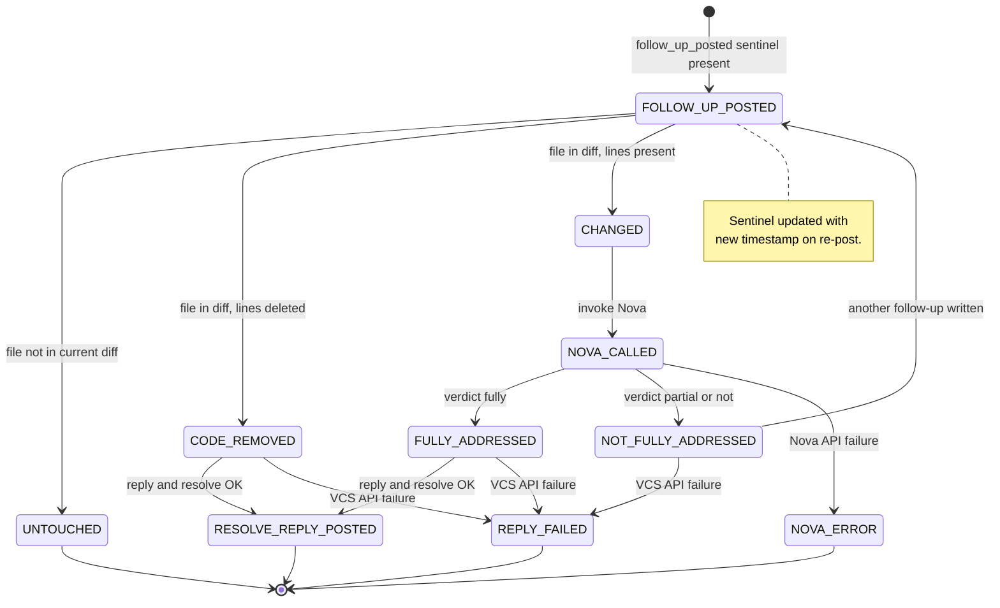
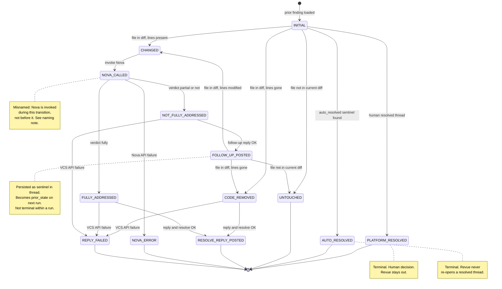
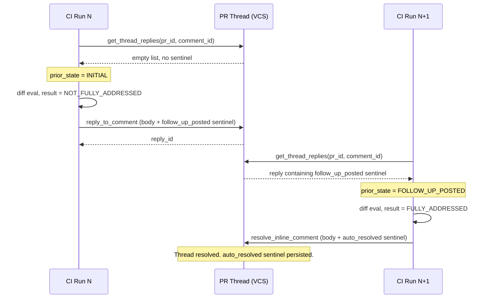

# HunkTracker State Machine

**Status:** Accepted (REVUE-211)
**Updated:** 2026-05-05
**Context:** Party mode design session — Daniel, Winston (architect)
**Implemented in:** `src/revue/comments/hunk_tracker.py`

---

## Purpose

HunkTracker answers one question per prior finding on each CI run:

> *"What happened to this finding since the last time Revue looked at it?"*

Because there is no persistent database between CI runs, state is carried forward through **sentinel markers** embedded in thread reply bodies (HTML comments invisible to developers). On each run, HunkTracker reads the thread replies, reconstructs prior state, evaluates the current diff, and decides whether to auto-resolve, post a follow-up, or do nothing.

---

## Naming Note: `NOVA_CALLED`

The state `NOVA_CALLED` is a **known misnomer**. At the point the machine transitions into this state, Nova has not yet been called — the transition *triggers* the call. A more accurate name would be `CALLING_NOVA` or `AWAITING_NOVA_VERDICT`. The name is preserved in code for backward compatibility with existing tests and dedup store values. Future refactors should rename it.

---

## State Reference

| State | Within-run or persisted? | Meaning |
|-------|--------------------------|---------|
| `INITIAL` | Within-run (starting) | Machine entry point for every prior finding each run |
| `PLATFORM_RESOLVED` | Within-run (terminal) | A human closed or resolved the thread on the platform |
| `AUTO_RESOLVED` | **Persisted** (terminal) | Revue confirmed the fix and resolved the thread; `auto_resolved` sentinel written |
| `UNTOUCHED` | Within-run (terminal) | The file containing the finding was not in the current diff |
| `CODE_REMOVED` | Within-run | The file is in the diff, but the specific lines are gone (deleted or restructured) |
| `CHANGED` | Within-run | The file is in the diff and the flagged lines are still present but modified |
| `NOVA_CALLED` | Within-run (misnamed — see above) | Nova is being invoked to judge whether the change resolves the finding |
| `FULLY_ADDRESSED` | Within-run | Nova returned `"fully"` — the issue is resolved |
| `NOT_FULLY_ADDRESSED` | Within-run | Nova returned `"partial"` or `"not"` — the issue persists |
| `NOVA_ERROR` | Within-run (terminal) | Nova API call failed; no action taken; retried next run |
| `REPLY_FAILED` | Within-run (terminal) | The VCS API call to post the reply failed; no sentinel written; retried next run |
| `FOLLOW_UP_POSTED` | **Persisted** | A follow-up reply was posted explaining what remains; `follow_up_posted` sentinel written |
| `RESOLVE_REPLY_POSTED` | Within-run (terminal) | A `"✅ resolved"` reply was posted and the thread was resolved |

**Only two states survive to the next CI run:** `AUTO_RESOLVED` and `FOLLOW_UP_POSTED`. All other states are transient within a single run.

---

## Within-Run vs Cross-Run

Three diagrams show the complete picture across CI runs. The sentinel written at the end of one run becomes the `prior_state` on the next — that connection is the only information that crosses the run boundary.

**Run N — first encounter (no prior sentinel):** All possible outcomes for a finding seen for the first time. Paths that end within Run N are terminal. Only `FOLLOW_UP_POSTED` creates a sentinel that carries into the next run.



**Run N+1 — continuation (follow_up_posted prior):** All possible outcomes when a `follow_up_posted` sentinel was found. `RESOLVE_REPLY_POSTED` writes an `auto_resolved` sentinel; `FOLLOW_UP_POSTED` updates the existing sentinel with a new timestamp and loops back on the next run.



**Run N+2 — terminal (auto_resolved prior):** Only one path is possible. `AUTO_RESOLVED` is a terminal state — the finding is never re-evaluated.



---

## State Diagrams

The full state space is split across four focused diagrams — one per scenario group. Each group maps directly to the rows in the [14 Legal Paths](#14-legal-paths) table below.

---

### Diagram 1 — Terminal paths (paths 1, 2, 3)

Three conditions exit immediately with no VCS API call.



---

### Diagram 2 — Code-removal paths (paths 4, 8)

File is in the current diff but the flagged lines no longer exist.



---

### Diagram 3 — Nova resolution paths, first occurrence (paths 5, 6, 7, 9)

File is in the diff and the flagged lines are still present. Nova evaluates whether the change resolves the finding.



---

### Diagram 4 — Continuation paths, follow-up prior (paths 10, 11, 12, 13, 14)

A `follow_up_posted` sentinel was found in the thread — this finding was seen before and not yet resolved. The machine re-evaluates from that prior state.



---

### Full State Diagram (complete reference)

All paths in one view. Use the diagrams above for per-scenario reading; use this for a complete structural overview.



---

## Sentinel cross-run lifecycle



---

## 14 Legal Paths

Each prior finding follows exactly one path per run. No branching within a path.

### Terminal paths — no action

| Path | Trigger | Machine sequence | Effect |
|------|---------|-----------------|--------|
| 1 | Human closed the thread | `INITIAL → PLATFORM_RESOLVED` | Dedup store updated. No comment. |
| 2 | `auto_resolved` sentinel present | `INITIAL → AUTO_RESOLVED` | Skip entirely. Terminal forever. |
| 3 | File not in current diff | `INITIAL → UNTOUCHED` | No action. Thread stays open. |

### Code-removal paths

| Path | Trigger | Machine sequence | Effect |
|------|---------|-----------------|--------|
| 4 | Lines deleted / file removed | `INITIAL → CODE_REMOVED → RESOLVE_REPLY_POSTED` | Post "✅ code removed", resolve thread, write `auto_resolved` sentinel. |
| 8 | Same, reply/resolve API fails | `INITIAL → CODE_REMOVED → REPLY_FAILED` | Log error. No sentinel. Retried next run. |

### Nova resolution paths — first occurrence

| Path | Trigger | Machine sequence | Effect |
|------|---------|-----------------|--------|
| 5 | Lines modified, Nova: "fully" | `INITIAL → CHANGED → NOVA_CALLED → FULLY_ADDRESSED → RESOLVE_REPLY_POSTED` | Post "✅ resolved", resolve thread, write `auto_resolved` sentinel. |
| 6 | Lines modified, Nova: "partial"/"not" | `INITIAL → CHANGED → NOVA_CALLED → NOT_FULLY_ADDRESSED → FOLLOW_UP_POSTED` | Post "⚠️ not fully resolved", write `follow_up_posted` sentinel. Thread stays open. |
| 7 | Lines modified, Nova API error | `INITIAL → CHANGED → NOVA_CALLED → NOVA_ERROR` | Log error. No action. Retried next run. |
| 9 | Lines modified, reply/resolve API fails | `INITIAL → CHANGED → NOVA_CALLED → FULLY_ADDRESSED → REPLY_FAILED` or `NOT_FULLY_ADDRESSED → REPLY_FAILED` | No sentinel. Retried next run. |

### Continuation paths — `FOLLOW_UP_POSTED` prior sentinel

| Path | Trigger | Machine sequence | Effect |
|------|---------|-----------------|--------|
| 10 | File still not in diff | `FOLLOW_UP_POSTED → UNTOUCHED` | No action. Prior follow-up still pending. |
| 11 | Lines deleted / file removed | `FOLLOW_UP_POSTED → CODE_REMOVED → RESOLVE_REPLY_POSTED` | Same as Path 4. |
| 12 | Lines modified, Nova: "fully" | `FOLLOW_UP_POSTED → CHANGED → NOVA_CALLED → FULLY_ADDRESSED → RESOLVE_REPLY_POSTED` | "✅ Your latest change fully resolves this issue." |
| 13 | Lines modified, Nova: "partial"/"not" | `FOLLOW_UP_POSTED → CHANGED → NOVA_CALLED → NOT_FULLY_ADDRESSED → FOLLOW_UP_POSTED` | Another follow-up posted. Sentinel updated with new timestamp. |
| 14 | Lines modified, Nova API error | `FOLLOW_UP_POSTED → CHANGED → NOVA_CALLED → NOVA_ERROR` | Log error. No action. Retried next run. |

---

## Forbidden Transitions (Guards)

All six are enforced as `InvalidStateTransitionError` via `HunkTracker._transition()`.

| Attempted transition | Why it is forbidden |
|---------------------|---------------------|
| `AUTO_RESOLVED → any` | Terminal. Revue must never re-open a thread it already resolved. |
| `PLATFORM_RESOLVED → any` | A human made a deliberate decision. Revue must not override it. |
| `UNTOUCHED → NOVA_CALLED` | Nova is meaningless on unchanged code. No diff, no check. |
| `FOLLOW_UP_POSTED → RESOLVE_REPLY_POSTED` (direct) | Must pass through `NOVA_CALLED` on the next run. Skipping the check would resolve without verification. |
| `NOVA_ERROR → RESOLVE_REPLY_POSTED` | Must not resolve a thread when the resolution check itself failed. |
| `NOVA_ERROR → FOLLOW_UP_POSTED` | Must not comment when the check failed. |

Any backward transition is also forbidden by construction: the machine is acyclic within a single run.

---

## Sentinel Format

Sentinels are HTML comments — invisible to developers in the UI, parseable by `HunkTracker._parse_sentinel()`.

```
<!-- revue:state=<state>:fp=<fingerprint>:ts=<ISO8601> -->
```

**Examples:**
```html
<!-- revue:state=auto_resolved:fp=a3f8c2d1:ts=2026-05-04T14:30:00Z -->
<!-- revue:state=follow_up_posted:fp=a3f8c2d1:ts=2026-05-04T16:45:00Z -->
```

Rules:
- Only `auto_resolved` and `follow_up_posted` values are written
- The most recent sentinel (by `ts`) is authoritative when multiple replies exist
- Sentinels are written into **thread replies**, not the original comment body
- If a reply fails, no sentinel is written — the finding is re-evaluated on the next run (idempotent)

---

## Known Limitations

### Reviewer edits original comment between CI runs

HunkTracker reads the original finding body from the VCS comment at evaluation time. If a reviewer edits their inline comment after Revue has already posted a `follow_up_posted` sentinel reply, the next CI run will call Nova with the **edited** body — not the body that triggered the original follow-up. This could cause Nova to evaluate against a different finding than the one the developer addressed.

**Why not addressed in REVUE-211:** Detecting this requires hashing the original finding body into the sentinel (`prior_body_hash`) and comparing on the next run. The edge case requires a reviewer to edit an already-replied-to comment — rare in practice, and the worst-case outcome is a slightly off Nova guidance message, not an incorrect resolve or data loss.

**If implemented:** `_make_sentinel()` would embed a hash of the original comment body. `_parse_sentinel()` would extract it. `resolution_status()` or `build_prior()` would compare against the current body and reset `prior_state` to `INITIAL` on mismatch. New AC, new tests required.

---

## Decision on `NOVA_CALLED` Rename

Renaming `NOVA_CALLED` to `CALLING_NOVA` or `NOVA_PENDING` is the right long-term call. It is deferred because:

1. The string `"nova_called"` is not persisted in sentinels (only `auto_resolved` and `follow_up_posted` are), so there is no migration risk for existing data.
2. Tests reference `HunkState.NOVA_CALLED` by name — a rename requires a test sweep.
3. The `_LEGAL_TRANSITIONS` frozenset uses enum values — rename is mechanical but broad.

When renaming, update: `comments/models.py`, `comments/hunk_tracker.py`, `tests/comments/test_hunk_tracker.py`, and this document.

---

## Implementation References

| Symbol | Location |
|--------|----------|
| `HunkState` enum | `src/revue/comments/models.py` |
| `HunkTracker` class | `src/revue/comments/hunk_tracker.py` |
| `_LEGAL_TRANSITIONS` | `src/revue/comments/hunk_tracker.py:38` |
| `_transition()` guard | `src/revue/comments/hunk_tracker.py:204` |
| `_SENTINEL_RE` | `src/revue/comments/hunk_tracker.py:70` |
| `resolution_status()` | `src/revue/comments/hunk_tracker.py:142` |
| State machine tests | `src/revue/tests/comments/test_hunk_tracker.py` |
| Poster integration | `src/revue/comments/poster.py` (AC5 loop) |
