# Positioning Architecture

**Status:** Accepted — AC7 complete as of 2026-05-09 (REVUE-236)
**Decision date:** 2026-05-09
**Context:** REVUE-236 per-platform PositionAdapter design

---

## Purpose

This document describes how Revue turns an agent-reported line number into a
platform-native comment anchor — the positioning pipeline. "Positioning" covers
everything from diff ingestion through agent review to the API call that places
an inline comment on the correct line of a PR or MR.

---

## Full Data Flow

```mermaid
flowchart TD
    CI([Platform CI trigger\nGitHub Actions · GitLab CI · Bitbucket Pipeline])
    CI --> FETCH[VCSAdapter.get_diff\nfetches raw unified diff]
    FETCH --> RAWDIFF[(diff file on disk)]

    RAWDIFF --> PARSE[DiffParser.parse_diff_file]
    PARSE --> FILECHANGES[list FileChange\nfile_path · diff text · language]
    FILECHANGES --> FILTER[filter_changes\nignore patterns · max_diff_lines]
    FILTER --> INCLUDED[included: list FileChange]

    INCLUDED --> CLEO{Premium tier?}
    CLEO -- yes --> CLEOROUTE[Cleo orchestrator\nassigns files to agents]
    CLEO -- no --> ALLFILES[all files → all agents]
    CLEOROUTE --> PARALLEL
    ALLFILES --> PARALLEL

    subgraph Agents [Parallel agent review]
        PARALLEL[run_agents_parallel] --> MAYA[maya\ncode quality]
        PARALLEL --> ZARA[zara\nsecurity]
        PARALLEL --> KAI[kai\nperformance]
        PARALLEL --> LEO[leo\narchitecture]
    end

    MAYA --> AIRLIST
    ZARA --> AIRLIST
    KAI --> AIRLIST
    LEO --> AIRLIST
    AIRLIST[flat list AIReview\nfile_path · line_number · issue · suggestion · confidence]

    AIRLIST --> GROUPA[Pass A — ProximityAndCountGroupingStrategy\nN ≤ 3 lines apart · K ≤ 3 per group]
    GROUPA --> GROUPS[list SynthesisGroup]

    subgraph Consolidation [Nova consolidation]
        GROUPS --> NOVA[NovaSingleShotStrategy\nNova AI call — one batch per run]
        NOVA --> CFLIST[list ConsolidatedFinding\nanchor · prose · code_replacement · attribution]
    end

    CFLIST --> DROPPER[NoOpSuggestionDropper\ndrops code_replacement that equals existing lines]
    DROPPER --> EXTRACTOR[UnanchoredFindingExtractor]
    EXTRACTOR -- anchored findings --> RESULTS[list ReviewResult\nfile_path · JSON payload]
    EXTRACTOR -- unanchored findings --> SINK1[(summary_sink)]

    RESULTS --> CLIBUILD[cli.py\ndiff_by_file = file_path → diff text\nbuilt from the same diff file]

    subgraph Positioning [Positioning — Poster.post]
        CLIBUILD --> POSTER[Poster.post\nreview_results · diff_by_file]
        POSTER --> PADAPTER{platform supported\nby PositionAdapter?}

        PADAPTER -- github · gitlab --> GETADAPTER[get_position_adapter\nGitHubPositionAdapter\nGitLabPositionAdapter]
        PADAPTER -- bitbucket · other --> SNAP[DiffPositionResolver.snap\nlegacy nearest-changed-line path]

        GETADAPTER --> RESOLVE

        subgraph Resolve [PositionAdapter.resolve — per finding group]
            RESOLVE[resolve\nreported_line · diff_content · file_path · rlc]
            RESOLVE --> PARSEDIFF[_parse_diff\nplus_new · context_new · minus_old · hunks]
            PARSEDIFF --> RULE{reported_line\nin plus_new?}
            RULE -- yes --> PP[PlatformPosition\nstart_line · end_line]
            RULE -- no context · removed · absent --> NONE[None]
        end

        PP --> APIPARAMS[PositionAdapter.to_api_params\nplatform-native dict]
        NONE --> SINK2[(summary_sink)]
        SNAP --> DIFFPOS[DiffPosition\nlegacy struct]
    end

    APIPARAMS --> VCSPOST[VCSAdapter.post_review_comment]
    DIFFPOS --> VCSPOST
    SINK1 --> SUMMARY[post_summary_comment\nPR-level summary block]
    SINK2 --> SUMMARY

    subgraph Platforms [Platform API calls]
        VCSPOST --> GH[GitHub\nPOST /pulls/N/reviews\npath · line · side · start_line]
        VCSPOST --> GL[GitLab\nPOST /merge_requests/N/discussions\nnew_path · new_line · base_sha · head_sha · start_sha]
        VCSPOST --> BB[Bitbucket\nPOST /pullrequests/N/comments\ninline.path · inline.to · inline.from]
    end
```



---

## Key design decisions

### Strict binary anchor rule (AC2)

`resolve()` classifies the reported line by parsing the per-file unified diff:

| Reported line maps to | Result |
|-----------------------|--------|
| `+` line (added or modified) | `PlatformPosition(start_line, end_line)` |
| context line (space-prefixed, unchanged) | `None` → `summary_sink` |
| `−` line (removed, no longer in new file) | `None` → `summary_sink` |
| not present in diff at all | `None` → `summary_sink` |

No snapping. No proximity heuristics. Positioning is deterministic once the diff
is frozen at CI trigger time.

### Per-platform adapters behind a shared Protocol

```
PositionAdapter (Protocol)
├── GitHubPositionAdapter   — path + line + side [+ start_line + start_side]
├── GitLabPositionAdapter   — new_path + new_line + base/head/start SHAs
└── BitbucketPositionAdapter — inline.path + inline.to [+ inline.from]
```

`get_position_adapter(platform, pr_context, vcs_adapter)` selects from a dict
registry — no `if/elif` chains (OCP maintained). For GitLab, the factory fetches
MR version SHAs once at construction time so each `to_api_params()` call is pure.

### Diff reuse

The diff file written by the CI step is parsed twice:

1. **Pipeline** — `parse_diff_file()` → `list[FileChange]` → agents receive
   `fc.diff` (per-file diff text) as their review context.
2. **Poster** — `_parse_diff_by_file()` → `{file_path: diff}` → passed to
   `Poster` so `resolve()` can classify agent-reported lines against the exact
   same diff the agent reviewed.

This identity guarantee is what makes the strict binary rule reliable.

### summary_sink

Two sources feed the PR-level summary comment:

- **`UnanchoredFindingExtractor`** — findings that reached the `Consolidator`
  but had no verifiable `snippet`/anchor evidence after consolidation.
- **`PositionAdapter.resolve() → None`** — findings whose agent-reported line
  is a context, removed, or absent line in the diff.

Both are routed to `summary_sink` and rendered with `(~line N)` notation to
signal an approximate location, not a verified anchor.

---

## Current gap — REVUE-236 AC7

`to_api_params()` output is not yet wired into the posting path. After `resolve()`
returns a `PlatformPosition`, `poster.py` discards the platform-specific dict
and wraps the line numbers back into a `DiffPosition` struct, which the legacy
adapter path then re-encodes independently.

Consequences until AC7 is fixed:

- `to_api_params()` is tested (unit + fixture level) but never executed in
  production.
- Bitbucket is excluded from `_POSITION_ADAPTER_PLATFORMS` and still uses
  `DiffPositionResolver.snap()`.
- GitLab's `post_review_comment()` re-fetches MR version SHAs on every comment
  instead of using the ones cached by `GitLabPositionAdapter`.

AC7 fix: replace the `DiffPosition` construction block with a direct call to
`to_api_params()` and pass the resulting dict straight to the platform API,
bypassing the legacy `DiffPosition` path.

---

## Fixture contract

Position fixtures live in `src/revue/tests/fixtures/positioning/{github,gitlab,bitbucket}/`.
Each fixture encodes:

- `diff_snippet` — the per-file unified diff
- `reported_line` — what an agent would emit
- `replacement_line_count` — multi-line span, default 1
- `expected_position` — expected `PlatformPosition` output, or `null` for None
- `expected_api_params` — expected `to_api_params()` output

Run all fixtures: `python scripts/local_run.py position --all`

---

## References

- [Comment Posting Architecture](comment-posting.md) — Consolidator, BodyBuilder, Poster contracts
- [Consolidation Architecture](consolidation.md) — Nova batch prompt format, SynthesisStrategy
- REVUE-236 — per-platform PositionAdapter implementation ticket
