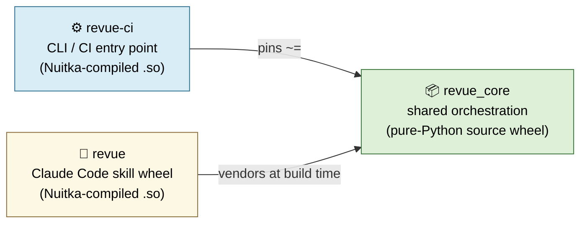
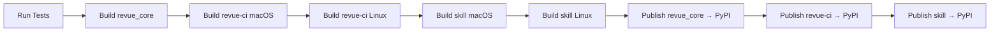

# Revue — Three-Package Distribution

Internal guide for the team. Covers how the three Revue Python packages are
built, signed, and published together as an atomic release set (REVUE-310).

## Package graph



| Package    | PyPI name     | Source                     | Distribution                | Audience                            |
|------------|---------------|----------------------------|-----------------------------|-------------------------------------|
| revue_core | `revue-core`  | `packaging/revue_core/`    | Pure-Python wheel + sdist   | Library consumers (revue-ci, revue) |
| revue-ci   | `revue-ci`    | `packaging/revue-ci/`      | Nuitka `.so` per platform   | CI runners, terminal users          |
| revue      | `revue`       | `packaging/revue/`         | Nuitka `.so` per platform   | Claude Code skill installs          |

### Why three packages, not one

- **`revue_core` is the leaf.** It must not import from `revue-ci` or `revue`.
  A pytest in `packaging/revue_core/tests/test_imports.py` grep-guards this.
- **`revue-ci` is the CI entry point.** It depends on `revue_core` at install
  time and adds the argparse / platform-adapter / posting layer that CI
  runners use. The wheel ships as Nuitka-compiled `.so` per platform so the
  on-disk CLI is opaque, even though `revue_core` itself is pure-Python.
- **`revue` is the Claude Code skill.** It vendors `revue_core` at build
  time (via `tools/vendor_sources.py`) and compiles the vendored modules to
  `.so` files for IP protection. It does NOT depend on `revue_core` at
  install time — the vendored copy is sufficient and lets the skill run
  offline within the 24-hour licence cache window.

## Tree layout

```text
packaging/
├── revue_core/                    # The leaf — shared library
│   ├── pyproject.toml
│   ├── src/revue_core/
│   │   ├── agents/                # YAML/MD agent definitions
│   │   ├── comments/              # body builder, dedup, position adapter
│   │   ├── core/                  # pipeline, models, AI clients
│   │   ├── infrastructure/        # licence validator, usage tracker
│   │   └── teams/                 # team YAML configs
│   └── tests/                     # leaf-constraint + import smoke tests
├── revue-ci/                      # CLI / CI entry point
│   ├── pyproject.toml             # depends on revue_core~=0.1.0
│   ├── src/revue_ci/
│   │   └── cli.py                 # revue-ci = revue_ci.cli:main
│   ├── build/
│   │   ├── build_nuitka.py        # compiles cli.py to .so
│   │   └── build_wheel.py         # assembles the platform wheel
│   └── tests/                     # unit + integration tests
└── revue/                         # Claude Code skill wheel
    ├── pyproject.toml             # entry: revue = revue_skill.cli:main
    ├── manifest.schema.json       # JSON Schema for the served manifest
    ├── manifest.example.json
    ├── src/revue_skill/
    │   ├── cli.py                 # install-skill | verify | version
    │   ├── manifest.py            # jsonschema validation
    │   ├── skill/                 # ⟵ vendored at build time
    │   └── vendored/              # ⟵ vendored at build time
    ├── tools/
    │   ├── sources.yaml           # source-of-truth → vendored target mapping
    │   └── vendor_sources.py      # vendor tool (run before `python -m build`)
    ├── build/
    │   ├── build_nuitka.py        # compiles vendored + orchestration to .so
    │   └── build_wheel.py         # assembles the platform wheel
    └── tests/
        ├── test_wheel_publishes_to_pypi.py
        ├── test_release_artefact_signed.py
        ├── test_manifest_schema_validates.py
        ├── test_signature_verification_in_installer.py
        ├── test_agent_prompts_packaged.py
        └── test_vendored_sources_in_sync.py
```

## Vendoring (skill wheel only)

`packaging/revue/tools/sources.yaml` maps source-of-truth files under
`packaging/revue_core/src/revue_core/`, `scripts/positioning/`,
`scripts/local_run.py`, and `_revue/` into `packaging/revue/src/revue_skill/`.
The vendor tool rewrites `from revue_core.<X>` imports into
`from revue_skill.vendored.<X>` so the bundled copy is self-contained.

`revue-ci` does NOT vendor — it imports `revue_core` at runtime from the
PyPI install, the same way any normal Python package consumes a dependency.

A pre-commit hook at `.githooks/pre-commit` re-runs `vendor_sources.py`
whenever a source-of-truth file is staged and fails the commit on drift.
`test_vendored_sources_in_sync.py` is the CI backstop for the same
invariant.

## Build (local, all three)

```bash
# revue_core — pure-Python source wheel
python -m build packaging/revue_core/

# revue-ci — Nuitka-compiled wheel (macOS / Linux)
python packaging/revue-ci/build/build_nuitka.py
python packaging/revue-ci/build/build_wheel.py

# revue skill — Nuitka-compiled wheel with vendored core
python packaging/revue/tools/vendor_sources.py --clean
python packaging/revue/build/build_nuitka.py
python packaging/revue/build/build_wheel.py
```

## Release flow (Bitbucket Pipelines)

A `v<semver>` tag triggers the `tags: 'v*':` pipeline in
`bitbucket-pipelines.yml`:



The publish chain is **fail-fast**: if `revue_core` publish fails, the
downstream `revue-ci` and `revue` publishes never run, preventing a release
where dependents pin a phantom `revue_core` version. Each publish step
`exit 1`s when its `dist/` is empty rather than skipping silently.

The tag-release step bumps all three `pyproject.toml`s in one commit so a
single tag ships a coherent version triple — `revue-ci` and `revue` can
pin `revue_core~={NEXT_VERSION}` and the constraint resolves on the next
`pip install`.

## Local smoke test (matches the CI flow)

```bash
python3 -m venv /tmp/revue-smoke && source /tmp/revue-smoke/bin/activate
pip install -e packaging/revue_core/ -e packaging/revue-ci/ -e packaging/revue/
revue-ci --help                              # CI entry point
revue install-skill --skip-verify --target-dir /tmp/skills  # skill installer
```

## Manifest schema

`packaging/revue/manifest.schema.json` documents the version manifest
served at `https://revue.sh/skills/manifest.json` (pre-MVP fallback:
`https://raw.githubusercontent.com/cbscd/revue/main/manifest.json`).

The install script fetches this manifest, validates it against the schema,
then verifies the declared wheel hash + Sigstore signature before copying
the skill into the user's home.

The optional `revue_core_min_version` field (REVUE-310) lets the manifest
declare the minimum `revue_core` version the skill was built against. If a
caller has a coexisting `revue_core` install older than that, the install
path can warn or refuse to load. The field is backwards-compatible —
existing manifests without it stay valid.

## External prerequisites

- [x] **PyPI Trusted Publisher** for `revue` (configured via Bitbucket
      `PYPI_API_TOKEN`)
- [ ] **PyPI Trusted Publisher** for `revue-core`
- [ ] **PyPI Trusted Publisher** for `revue-ci`

Once the additional PyPI rights are granted on the existing token, tag
`v0.1.0` and the pipeline does the rest.

## Updating after upstream change

Any change to a `revue_core` source-of-truth file requires re-vendoring
the skill wheel:

```bash
python packaging/revue/tools/vendor_sources.py --clean
git add packaging/revue/src/revue_skill/
```

The pre-commit hook will auto-run the vendor tool when triggers are staged,
but you must `git add` the regenerated `vendored/` tree and re-commit.
Skipping this trips `test_vendored_sources_in_sync.py` in CI.

`revue-ci` doesn't vendor, so changes to `revue_core` don't require any
re-vendor step on the revue-ci side — the next `pip install revue-ci`
picks up the new `revue_core` per the `~=` constraint.
