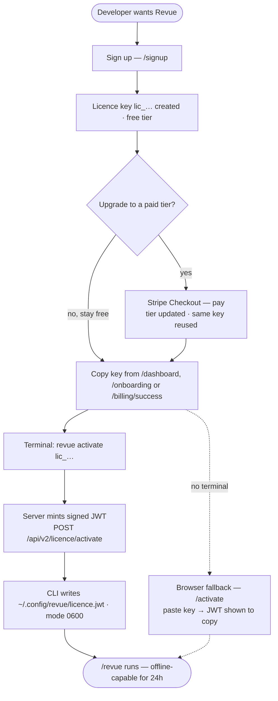

# UX Design Spec — CLI-first Activation Flow

> **Decision baseline (Daniel, 2026-06-02; reconciled 2026-06-05):** Go CLI-first — lead with
> `revue activate <key>`. The licence key is delivered through the **authenticated web**
> (`/billing/success`, `/onboarding`, Account→Plan) and copied into the CLI. **There is no
> activation email** — the email rework was *rejected* (REVUE-383); activation is fully CLI +
> authenticated-web. Users **copy-paste the key manually** (no pre-fill token — descoped; the key
> never travels in a URL). The `/activate` page is demoted to a thin browser fallback.
>
> **Two modes are first-class and must be communicated everywhere (Daniel, 2026-06-05):**
> - **CLI mode (primary)** — `revue activate <key>` → local & pre-commit reviews (the `/revue-local` flow). "The command is the hero."
> - **CI mode (secondary, maintained)** — `REVUE_LICENSE_KEY` secret + pipeline YAML → reviews Pull/Merge Requests in CI. CI setup gets its own detailed page (REVUE-407).
>
> **Not part of REVUE-357 (legal pages).**

---

## 0. As-built vs designed — read this first

This spec mixes shipped reality with forward design. Status tags:

| Surface | Status (2026-06-05) | Owner ticket |
|---|---|---|
| `revue activate <key>` CLI | ✅ Built (`packaging/revue/src/revue_skill/`) | REVUE-277 (Done) |
| `/api/v2/licence/activate` (mint JWT) | ✅ Built, rate-limited | REVUE-277 / 325 (Done) |
| `/dashboard` licence card (masked key + show/copy) | ✅ Built (`partials/license_card.html`) | REVUE-59 (Done) |
| `/onboarding` (shows full key, **CI-secret framed**) | ⚠️ Built but CI-first — needs CLI-first refactor | REVUE-361 |
| `/billing/success` ("You're all set!", **no key/command**) | ❌ Dead-ends — the core gap | REVUE-361 |
| Activation Command-Box (reusable component) | ❌ Design-only (`copyToClipboard` exists in `base.html`) | REVUE-384 (owns it) |
| `/activate` (mints **raw JWT**, no command-box echo) | ⚠️ Built as hero — must demote | REVUE-384 |
| Account → Plan page | ❌ Design-only (data scattered on `/dashboard`) | REVUE-382 |
| Dedicated CI setup page | ❌ Not built (content scattered: `onboarding.html` + `docs/quickstart-*`) | REVUE-407 |
| Site-wide two-mode messaging (`landing.html` is **CI-only**) | ❌ Not built | REVUE-408 |
| Out-of-process E2E harness (web UI E2E is CI-excluded today) | ❌ Not built — **prerequisite** | REVUE-332 |
| Post-merge staging E2E | ❌ Not built | REVUE-409 |
| Licence-key email | 🚫 **Rejected** | REVUE-383 |

---

## 1. The problem, in one scene

A developer just paid. Card charged, motivation peaking, they want Revue working in 60 seconds.
Every extra step — hunt for a key, copy a JWT blob, `chmod 600` a file — is where excitement
leaks out and refund requests leak in.

Two personas share this moment:

| Persona | Lives in | Wants | Primary path |
|---|---|---|---|
| **Developer** | terminal / Claude Code | `revue activate <key>` → done | CLI |
| **Payer** | browser; may have bought *for* a developer | grab the key, hand it off | Account→Plan + dashboard (authenticated web — **not email**) |

**Design rule:** the command is the hero, the browser is the safety net, the authenticated
Account page is the source of truth.

## 2. Why CLI-first (the core rationale)

`revue activate <key>` mints the signed JWT **and writes it** to `~/.config/revue/licence.jwt`
(mode 0600) in one step. A web page physically cannot write to `~/.config`, so the browser path
must show a JWT blob for manual copy — inherently clunkier. We therefore make the CLI the
recommended path everywhere and keep the browser only as a no-terminal fallback.

## 3. End-to-end journey (happy path — as built)



> **As-built note (2026-06-05):** the key is delivered through the **authenticated web**
> (`/dashboard`, `/onboarding`, and — once REVUE-361 lands — `/billing/success`) and copied into
> the CLI. There is **no activation email** (REVUE-383 rejected). The biggest live gap is that
> `/billing/success` currently shows no key/command (REVUE-361 fixes it).

## 4. The reusable component: Activation Command-Box

**Status:** design-only. `copyToClipboard` exists (`base.html:42`); the component itself is built by **REVUE-384** and consumed by REVUE-361 + REVUE-382. One component, three homes (post-purchase handoff, Account→Plan invalid state, `/activate`). Consistency = familiarity.

**Anatomy**
- Dark rounded card, brand border.
- Monospace line: `revue activate lic_9f2a…c7b1` (full key, pre-filled).
- **Copy button** → flips to "Copied! ✓" for 2s (reuse existing `copyToClipboard` in `base.html`).
- One-line caption: *"Writes your licence so Revue runs offline."*

**States**
- `default` — command + copy.
- `copied` — transient confirmation.
- `masked` (Account→Plan active state; payer-handoff line) — shows `lic_••••c7b1`, copy still yields full key.

```
┌────────────────────────────────────────────┐
│  Activate Revue                             │
│  ┌──────────────────────────────────┐  ⧉   │
│  │ revue activate lic_9f2a…c7b1     │ Copy │
│  └──────────────────────────────────┘      │
│  Writes your licence so Revue runs offline. │
└────────────────────────────────────────────┘
```

## 5. Account → Plan — the source of truth

**Status:** design-only (REVUE-382). Today the data is scattered on `/dashboard` (tier badge + `license_card` masked key + `usage_bar`); there is no validity status, "last verified", or renewal line, and no consolidated Account→Plan page. Authenticated page; knows the real key + status. **Three states.**

### 5a. ✅ Active
- Plan badge: Free / Indie / Pro.
- "Licence active ✓"
- Masked key `lic_••••c7b1` + copy (yields full key — this is the Payer's handoff tool).
- Validity: "Valid · renews 2 Jul 2026" or "Perpetual". *(Depends on REVUE-389 billing data.)*
- Usage meter: "12 / 25 reviews this month" or "Unlimited". *(Usage data source unresolved — see §11.)*
- Trust signal: "Last verified 4 h ago" (explains the 24h offline cache).

### 5b. ⚠️ Not activated / invalid
- Headline: "Finish setting up Revue".
- **Activation Command-Box** (REVUE-384 component), key pre-filled.
- Secondary link: "Prefer a browser? Paste your key here →" (to `/activate`).

### 5c. 🔴 Lapsed subscription
- **Never say "invalid"** (implies *we* broke). Say: "Your Pro plan ended — renew to keep unlimited reviews."
- Primary CTA: Re-subscribe (Stripe). Secondary: downgrade to Free.

## 6. Post-purchase handoff (replaces the rejected email) — REVUE-361

The original §6 ("Licence-key email rework") is **rejected** (REVUE-383). Its job — telling a
just-paid user how to activate — is now done **on-screen**, which is cheaper (no SMTP, no
deliverability testing) and keeps the key out of email entirely.

**`/billing/success` and `/onboarding` both render, in order:**
1. **Activation Command-Box (hero)** — `revue activate lic_…` + copy. CLI mode, the primary path.
2. **Masked payer-handoff line** — `lic_••••c7b1`, labelled "Copy key to share with your developer"; copy yields the full key.
3. **"Two ways to use Revue"** — a compact **CI card** ("Reviewing in CI? Set up your pipeline →") linking to the CI setup page (REVUE-407). No inline CI YAML — `/onboarding`'s current GitHub/GitLab YAML is consolidated into REVUE-407.

> The licence-key email design (subject line, command-led body, plain-text part) is preserved in
> git history on REVUE-383 should transactional email ever be revived (e.g. password reset).

## 7. /activate page — demoted to thin fallback (REVUE-384)

**Status:** built as a hero (REVUE-277) that mints a **raw JWT** with no command-box echo — must be demoted.

- Must work **unauthenticated** (a no-terminal payer may not be logged in).
- **Step 1:** a single "Paste your licence key" input (the key comes from the dashboard/handoff page, **not** email).
- **Step 2 (on valid paste):** the **Activation Command-Box** echoes `revue activate <pasted-key>` as the recommended path (copy button), so even the browser fallback steers toward the CLI.
- Below the fold, collapsed: **"Activate in browser (advanced)"** — the existing paste-key→get-JWT mint form, the only place the raw JWT blob appears.
- No longer a hero surface; no marketing.

## 8. Security — manual paste (token mechanism descoped for MVP)

Daniel chose **manual copy-paste** (2026-06-02). This is the simpler MVP and is *more* private:

- **No pre-fill token is built.** No token issuance, no TTL, no single-use bookkeeping.
- The raw key **never travels in a URL** → nothing in click logs, browser history, or referer headers.
- The key is shown only on **authenticated web surfaces** (dashboard / Account→Plan / post-purchase handoff) and copied by the user — it does **not** travel by email (the email channel was rejected). Treat those authenticated pages as the sensitive surface.
- **Future option (post-MVP):** if friction data shows the paste step hurts conversion, revisit a one-time pre-fill token then.

## 9. Edge cases (do not skip)

| Case | UX response | Status |
|---|---|---|
| **Already activated on another machine** (fingerprint mismatch) | Guide, don't alarm: "This licence is active on another device. Re-run activate here to move it." | CLI messaging — verify |
| **Offline / 24h cache** | Tooltip on validity: "Activated once, Revue works offline for 24 h." | ✅ behaviour built (REVUE-278); tooltip design-only |
| **Lapsed subscription** | §5c — "ended, renew," not "invalid." | REVUE-382 |
| **Payer ≠ developer** | Handoff line copy: "Copy key to share with your developer." | REVUE-361 / 382 |
| **Empty / malformed key pasted on /activate** | Inline validation against `^lic_[a-f0-9]{32}$` before command-box or mint. | REVUE-384 |
| **Free tier (no paid key)** | Account→Plan shows Free + "Upgrade"; no command-box. `/onboarding` still shows the command-box hero (free keys activate too). | REVUE-382 / 361 |

## 10. Scope & ticket impact (final map)

**MVP launch blockers (epic REVUE-269, label `mvp`):**

| Ticket | What | Notes |
|---|---|---|
| **REVUE-332** | Out-of-process uvicorn E2E fixture | **Prerequisite** — unblocks all web-UI E2E in CI |
| **REVUE-384** | Demote `/activate`; **build the shared Command-Box** | Sequence before 361/382 |
| **REVUE-361** | Post-purchase activation handoff (`/billing/success` + `/onboarding`) | Consumes 384; links to 407 |
| **REVUE-382** | Account → Plan licence-status page | Consumes 384; data deps on 389 + usage source |
| **REVUE-407** | Dedicated `/docs/ci-setup` page | Consolidates onboarding + `quickstart-*`; link target for 361/408 |
| **REVUE-408** | Site-wide two-mode (CLI/CI) messaging | `landing.html` is CI-only today; shared partial |
| **REVUE-409** | Post-merge Playwright E2E vs staging | Reuses 361/382/384 tests via `E2E_BASE_URL`; per-state staging accounts |

**Build order:** `332 → 384 → 361 + 382 → 407 → 408 → 409`.

**Rejected:** REVUE-383 (licence-key email) — superseded by on-screen handoff.

**Coordinate (naming / same-file):**
- **REVUE-386** — `revue` vs `revue-local` naming feeds 361/384/407/408 command strings — resolve first or in lockstep.
- **`landing.html` collision** — REVUE-408 vs REVUE-281 (cost messaging) + REVUE-366 (Claude-Code-only disclaimer); agree branch order.

**Explicitly descoped from MVP:** the one-time pre-fill token; regenerate-key; multi-seat handoff.

**Testing standard:** all UI tests are out-of-process Playwright (subprocess uvicorn — the REVUE-332 fix), parameterised by `E2E_BASE_URL` so REVUE-409 reuses them against staging.

## 11. Open questions for the team

- ~~Does the email send the key/link today?~~ **Resolved:** no email exists; the channel is rejected (REVUE-383). Delivery is authenticated-web + CLI.
- **Account→Plan: net-new page or a section on `/dashboard`?** Still open (REVUE-382) — check `dashboard_routes.py` / `templates/dashboard.html`. Sets the route REVUE-409 navigates to.
- **`/activate` "browser mint":** keep the raw-JWT advanced fallback for the genuinely-no-CLI user (decided — kept, below the fold in REVUE-384).
- **Usage-meter data source** for Account→Plan (REVUE-382) — owner/shape unresolved; blocks the Active-state meter.

---

*This spec is intentionally focused (a known functional flow), not a greenfield UX exploration.
It is reconciled to as-built state on 2026-06-05 and sharded into the tickets in §10.*
