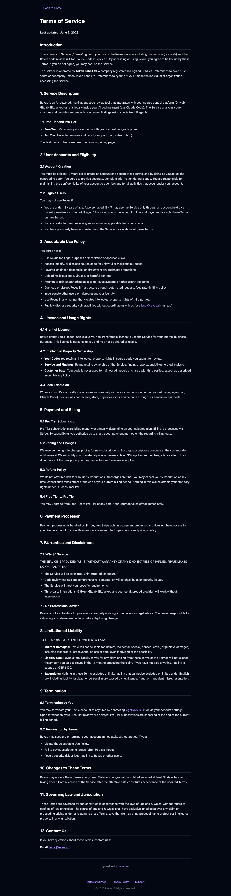
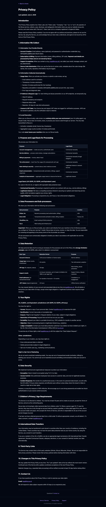
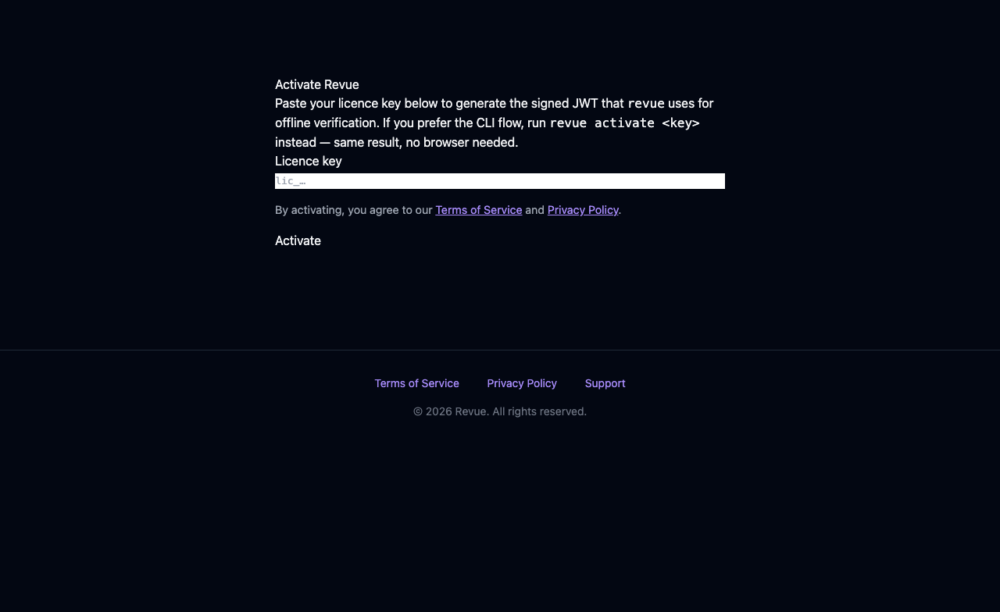

# REVUE-357 — Privacy Policy + Terms of Service — Rendering Evidence

Full-page screenshots captured via Playwright (Chromium) against the local FastAPI
server (`src/web`), branch `REVUE-357-privacy-tos`. Captured 2026-06-02.

These confirm the legal pages render professionally: clear heading hierarchy,
proper bullet lists (not collapsed run-on paragraphs), rendered Markdown tables,
a single shared footer with Terms / Privacy / Support links on every page, and
`legal@revue.sh` as the contact address.

## `/terms` — Terms of Service

- Full ToS rendered (Service description → Acceptable Use → Limitation of Liability → Governing Law → Contact).
- Heading hierarchy distinct (h1 32px / h2 21.6px w/ rule / h3 17.6px).
- Single footer at the bottom.

## `/privacy` — Privacy Policy

- Full Privacy Policy with 3 rendered Markdown tables (data inventory, sub-processors, retention).
- Local-execution boundary ("your code never leaves your machine") stated explicitly — no command token named (the `/revue` vs `/revue-local` naming is reconciled separately in REVUE-386).
- UK-GDPR rights section + named sub-processors (Stripe, Brevo, Cloudflare, Fly.io). AI-inference vendors are intentionally not named.
- Contact address is `legal@revue.sh` (mailto links); operator is Token Labs Ltd, England & Wales.

## `/activate` — Consent on the activation flow

- Consent line "By activating, you agree to our Terms of Service and Privacy Policy" sits **above** the Activate button (exposed pre-submission per TC4).
- Both links resolve to `/terms` and `/privacy`.

## Notes

- All legal prose carries `[PENDING LEGAL REVIEW]` + `[PENDING REGISTRATION]` HTML comments (not rendered to users) — counsel sign-off and Companies House registration of Token Labs Ltd required before public launch (registration tracked in REVUE-381).
- Out-of-scope follow-up logged: the site-wide Tailwind Typography plugin is not loaded, so `/docs` markdown headings are also flat. The legal pages ship self-contained heading styles scoped to `legal.html`; the docs styling gap is tracked in REVUE-387.
