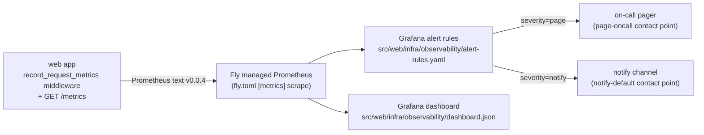

# `/activate` observability — operations runbook

Real-time alerting and the dashboard for `POST /api/v2/licence/activate`
(REVUE-362). The endpoint exchanges a licence key for a signed RS256 JWT and is
rate-limited + auth-hardened (REVUE-325); this runbook is the matching incident
side — error-rate, latency, and traffic-anomaly alerts so abuse or an outage is
noticed within minutes even when individual requests are blocked.

> Licence-key handling and JWT signing are covered by
> [`jwt-signing-key.md`](./jwt-signing-key.md). This runbook covers metrics and
> alerts only.

## How metrics flow

- **Instrumentation:** `src/web/metrics.py` emits two series, keyed by
  `(method, route, status)` where `route` is the FastAPI route *template* (never
  the raw path, so per-request identifiers cannot explode cardinality):
  - `revue_http_requests_total` (counter) — drives error-rate + traffic alerts.
  - `revue_http_request_duration_seconds` (histogram, 2.0s on a bucket boundary)
    — drives the p95 latency alert.
  The `record_request_metrics` middleware in `src/web/main.py` times every
  request; `/metrics` is excluded from its own counters so scrapes don't become
  the traffic baseline.
- **Scrape:** `fly.toml` / `fly.staging.toml` `[metrics]` block points Fly's
  managed Prometheus at `:8080/metrics`.
- **Alerts + dashboard:** committed as code under
  `src/web/infra/observability/`. The metric names there are bound to the code by
  `src/web/tests/test_observability_config.py`, so a rename in one place fails CI
  rather than silently killing an alert.

## Alerts

| Alert | Condition (over 5 min) | Severity | AC |
|---|---|---|---|
| `ActivateErrorRateHigh` | 5xx ratio > 5% | page | AC1 |
| `ActivateLatencyP95High` | p95 > 2s | page | AC2 |
| `ActivateTrafficAnomaly` | RPS > 10× the 1h baseline | notify | AC3 |

Routing is by the `severity` label in `alert-rules.yaml`:
`page` → `page-oncall`, `notify` → `notify-default`.

## Dashboard

`src/web/infra/observability/dashboard.json` (uid `revue-activate-observability`)
panels: request rate, error rate, latency p50/p95/p99, status-code distribution.

## Deploying the config

The alert rules and dashboard are **provisioned** into Fly's managed Grafana.
The contact-point integration secrets (pager key, notify webhook) are
**Grafana secrets** and are deliberately NOT in the committed YAML — only the
contact-point *names* are referenced.

1. Confirm `[metrics]` is live: `fly deploy` (config already in `fly*.toml`),
   then check the app's `/metrics` returns the exposition text.
2. Provision the two contact points in Grafana with their secrets out of band:
   - `page-oncall` → on-call pager (PagerDuty/Opsgenie integration key).
   - `notify-default` → lower-urgency channel (e.g. Slack webhook).
3. Import `alert-rules.yaml` and `dashboard.json` into the Grafana instance
   (provisioning directory or API). The Prometheus datasource uid is
   `prometheus`.

## Post-deploy validation (story Test Cases)

These are **live-infra E2E** checks — they cannot pass in CI and must be run
against staging after deploy (this ticket carries
`do-not-run-automation-after-merge`; it stays in Code Review until validated):

1. **Error-rate:** drive a synthetic 5xx burst at `/activate` on staging (e.g.
   force `JWT_SIGNING_KEY` unset to provoke 500s, or replay invalid bodies) →
   `ActivateErrorRateHigh` fires in < 5 min.
2. **Traffic anomaly:** generate ~1000 RPS against `/activate` on staging →
   `ActivateTrafficAnomaly` notifies.
3. **Dashboard:** open the dashboard and confirm all four panels load live data
   from the staging Prometheus.

## Responding to an alert

- **`ActivateErrorRateHigh`** — check `/metrics` status-code split and recent
  deploys. A spike of `500 server_misconfigured` means the `JWT_SIGNING_KEY` Fly
  secret is missing/rotated — see [`jwt-signing-key.md`](./jwt-signing-key.md).
  A spike of `429`/`403` is rate-limit / inactive-licence pressure, not an
  outage — correlate with the flood events from REVUE-325.
- **`ActivateLatencyP95High`** — usually DB contention (single sqlite worker) or
  a slow signing path; check machine CPU and the request rate panel.
- **`ActivateTrafficAnomaly`** — likely key brute-forcing or a runaway client;
  cross-reference the per-IP / per-key rate-limit logs.
